# AI Interview Coach

<div align="center">


**Personalized, AI-driven interview preparation — powered by Google Gemini**

[](https://ai-interview-coach-six-opal.vercel.app/)
[](https://ai-interview-coach-backend-nfu8.onrender.com)
[]()

[🚀 Live Demo](https://ai-interview-coach-six-opal.vercel.app/) · [Backend API](https://ai-interview-coach-backend-nfu8.onrender.com) · [Report an Issue](../../issues)

</div>

---

## 📋 Overview

**AI Interview Coach** is a free, full-stack web application designed to help job candidates overcome interview anxiety through realistic, personalized practice. 

### The Problem It Solves
Job interviews are high-stress situations where candidates often underperform due to lack of practice and feedback. Traditional interview coaching is expensive, time-consuming, and unavailable 24/7. Most candidates interview 5-10 times before mastering their pitch and responses.

**Who it's for:** Software engineers, data scientists, product managers, and tech professionals preparing for job interviews who need instant, constructive AI feedback without paying hundreds of dollars for coaching services.

### How It Works
1. **Upload your resume** (PDF or text) — the system parses it to understand your experience
2. **Select a target job role** — e.g., "Full Stack Engineer", "Data Scientist", "Product Manager"
3. **Get 5 AI-generated interview questions** — tailored specifically to your resume and the target role
4. **Answer each question** — submit written responses
5. **Receive instant AI feedback** — get a score (1–10), specific strengths, actionable improvements, and a model answer to learn from
6. **Track your progress** — review all past sessions and watch your average score improve over time

### Live Deployment

| Service | Platform | URL |
|---|---|---|
| **Frontend (React SPA)** | Vercel | [https://ai-interview-coach-six-opal.vercel.app/](https://ai-interview-coach-six-opal.vercel.app/) |
| **Backend (REST API)** | Render | [https://ai-interview-coach-backend-nfu8.onrender.com](https://ai-interview-coach-backend-nfu8.onrender.com) |

> **Note:** The backend runs on Render's free tier, which suspends inactive services. A scheduled [cron-job.org](https://cron-job.org) health-check ping keeps the API warm and minimizes cold-start latency for end users.

---

## ✨ Key Features

✅ **Resume-Aware Question Generation** — Parses uploaded PDF resumes (including scanned/image PDFs with OCR fallback) and generates role-specific behavioral and technical interview questions using the Gemini API.

✅ **Real-Time Answer Evaluation** — Each response is scored (1–10) with structured, constructive feedback including:
   - Key strengths observed in the answer
   - Actionable areas for improvement  
   - A model sample answer demonstrating a top-tier response

✅ **Session History & Performance Analytics** — All practice sessions are persisted with:
   - Average overall score
   - Behavioral vs. Technical question breakdown
   - Timestamp and question count for each session
   - Searchable history browser

✅ **Interview Preparation Guidance** — In-app tips modal with best practices for interview readiness

✅ **Fully Responsive Interface** — Works seamlessly across desktop, tablet, and mobile viewports

✅ **Independent, Production-Ready Deployment** — Frontend and backend are decoupled and independently deployable

---

## 📸 Screenshots

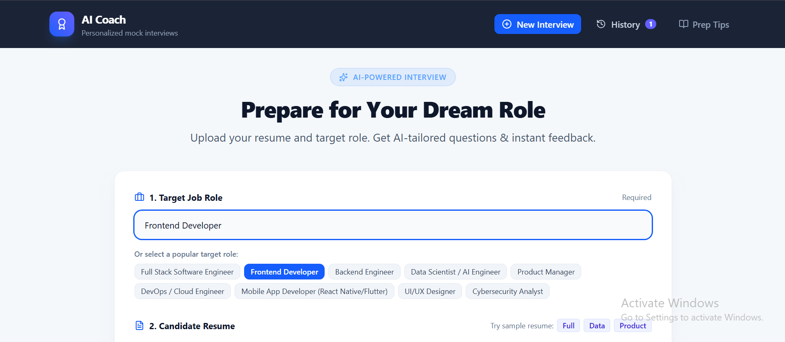
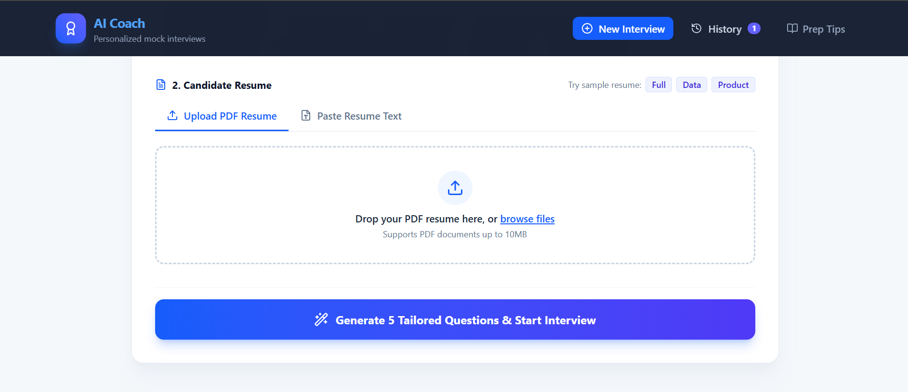
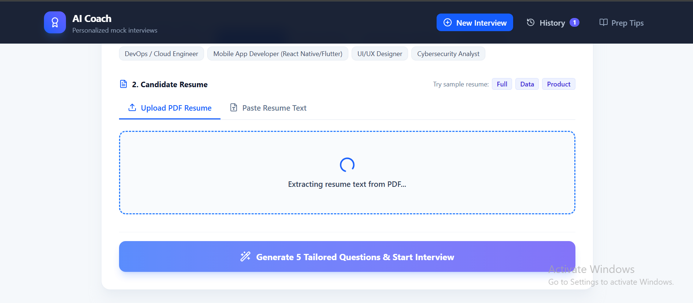
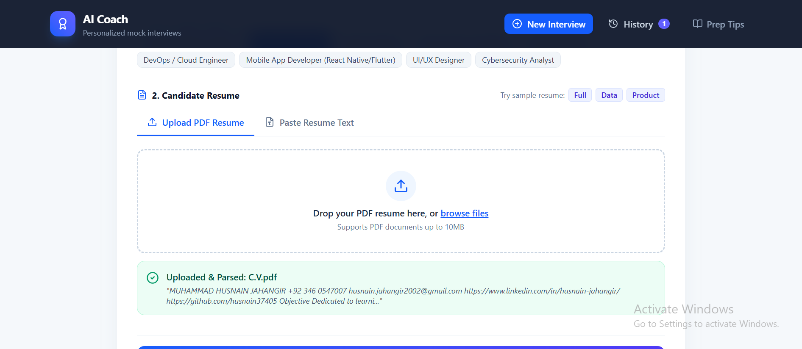
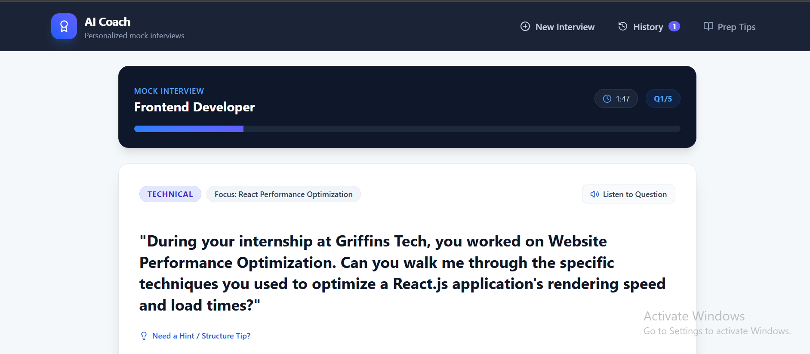
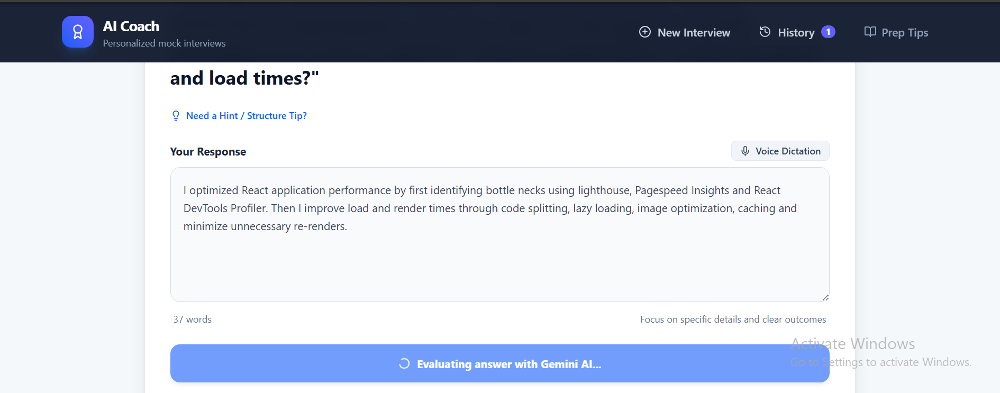
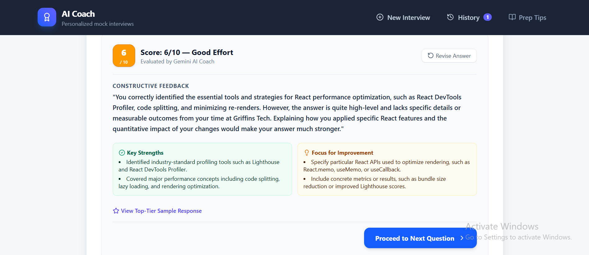
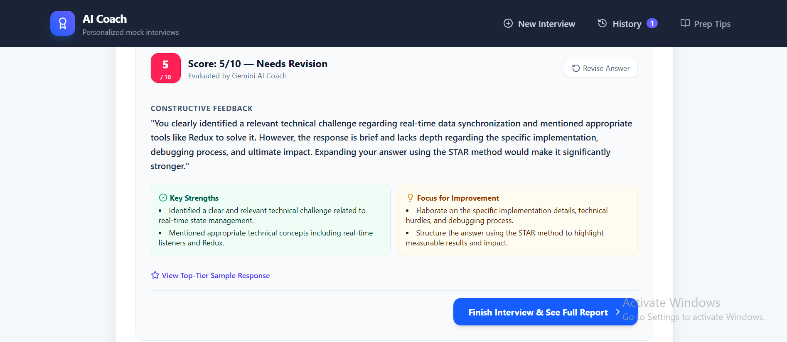
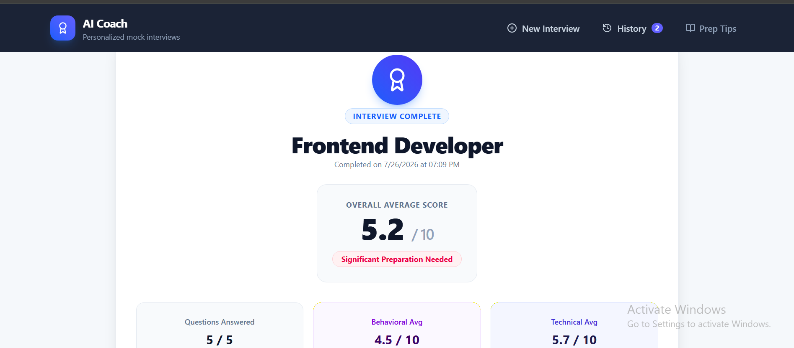
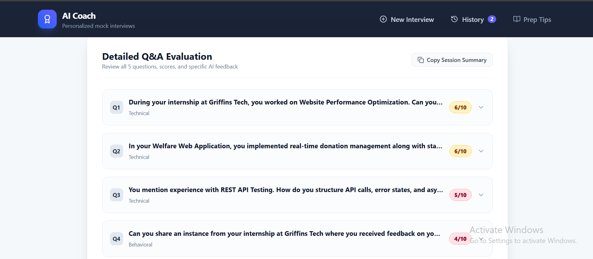
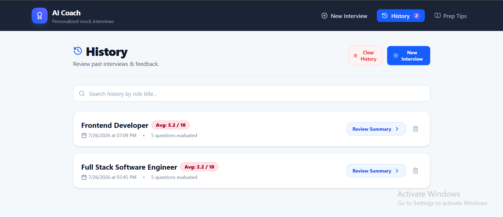

---

## 🤖 AI Feature Explanation

### Interview Question Generation

**AI Model:** Google Gemini 3.6 Flash

**System Instruction:**
```
"You are a world-class senior technical recruiter and hiring manager conducting a realistic job interview."
```

**How It Works:**
- Analyzes the candidate's uploaded resume and target job role
- Generates exactly 5 interview questions tailored to the candidate's experience level and the role requirements
- Produces a balanced mix:
  - **Behavioral questions** (3 questions): Test soft skills like communication, conflict resolution, leadership, teamwork
  - **Technical questions** (2 questions): Test domain-specific knowledge relevant to the resume and role

**Output Schema** (JSON):
```json
[
  {
    "id": "q1",
    "question": "Full interview question text",
    "type": "behavioral | technical",
    "focus": "Competency being tested (e.g., 'React State Management')",
    "hint": "STAR method tip or guidance for structuring a strong answer"
  },
  ...
]
```

### Answer Scoring & Feedback

**AI Model:** Google Gemini 3.6 Flash

**System Instruction:**
```
"You evaluate candidate interview answers constructively and fairly."
```

**Evaluation Dimensions:**
- **Clarity** — Is the response well-structured and easy to follow?
- **Relevance** — How directly does it address the question asked?
- **Depth** — Does it demonstrate technical or behavioral specificity?
- **Examples** — Are there concrete, real-world illustrations or proof points?
- **Growth Mindset** — Does it show reflection, learning, and continuous improvement?

**Output Schema** (JSON):
```json
{
  "score": 7,
  "feedback": "2-3 sentences of constructive feedback highlighting strengths and areas to improve",
  "strengths": [
    "Mentioned relevant technologies",
    "Provided real-world context"
  ],
  "improvements": [
    "Detail token security mechanisms (HttpOnly cookies, XSS prevention)",
    "Explain real-time update handling (Socket.io or WebSockets)"
  ],
  "sampleAnswer": "A high-scoring exemplar response demonstrating best-in-class interviewing..."
}
```

**Scoring Logic:**
- **9–10:** Outstanding — comprehensive, specific, demonstrates mastery, includes concrete examples
- **7–8:** Strong — clear response with good depth, minor gaps in detail
- **5–6:** Adequate — addresses the question but lacks depth or specificity
- **3–4:** Below Average — misses key points, vague or incomplete
- **1–2:** Poor — off-topic, uninformed, or minimal effort

---

## 📚 Project Background

This project began as a prototype built in Google AI Studio. Since then, the following engineering work has been completed independently:

- **Restructured the codebase** from a single AI Studio export into a clean, separated `frontend/` and `backend/` project layout suitable for independent deployment and version control.
- **Rebuilt the UI for full mobile responsiveness**, ensuring usability across all screen sizes rather than the desktop-first prototype layout.
- **Decoupled the frontend and backend into independently deployable services**, rather than a single bundled server.
- **Deployed to production**: frontend on **Vercel**, backend on **Render**.
- **Configured a scheduled uptime ping via cron-job.org** to mitigate free-tier backend cold starts.
- **Hardened CORS, environment configuration, and API error handling** for a live, public-facing deployment.

---

## 🏗️ Architecture

### Tech Stack & Tools

**🤖 AI & ML**
- **Google Gemini API** (gemini-3.6-flash model)
  - Interview question generation with structured JSON responses
  - Real-time answer evaluation and scoring
  - OCR text extraction from scanned/image-based PDFs

**Frontend (React SPA)**
- **React 19** — UI components and state management
- **TypeScript** — Type-safe code
- **Vite 6** — Lightning-fast build tooling and dev server
- **Tailwind CSS 4** — Utility-first responsive styling
- **Lucide React** — Beautiful, consistent icon system
- **Motion** — Smooth animations and transitions

**Backend (Node.js REST API)**
- **Node.js (ES Modules)** — JavaScript runtime
- **Express.js 4** — Web framework and routing
- **CORS** — Cross-origin request handling
- **unpdf** (PDF.js) — Modern PDF text extraction for Node.js
- **pdf-parse** — Fallback PDF parsing library
- **pdf2json** — Additional PDF parsing capability
- **pdf-lib** — PDF creation and manipulation utilities
- **dotenv** — Environment variable management

**Database & Storage**
- **JSON file-based persistence** — Session history stored as `history.json` on backend
- *Note: Currently file-based; future roadmap includes PostgreSQL/MongoDB migration*

**Cloud Hosting & DevOps**
- **Vercel** — Frontend hosting with automatic CI/CD on Git push
  - Handles SPA routing, static asset optimization
  - Global CDN for fast content delivery
  - Environment variables for `VITE_API_URL`

- **Render.com** — Backend REST API hosting
  - Docker-compatible Node.js deployment
  - Free tier with auto-suspend on inactivity
  - Health check endpoint: `/health`

- **cron-job.org** — Scheduled uptime pinging
  - Pings backend `/health` endpoint every 5 minutes
  - Keeps service warm and ready for user requests
  - Reduces cold-start latency on free tier

**Version Control & Deployment**
- **Git** — Distributed version control
- **GitHub** — Repository hosting with automated deployments
  - Vercel deployment on `main` push
  - Render deployment on Git push

### Project Structure

```
ai-interview-coach/
├── frontend/                     # React SPA (deployed to Vercel)
│   ├── public/
│   │   └── favicon.svg
│   ├── src/
│   │   ├── components/
│   │   │   ├── Header.tsx
│   │   │   ├── SetupView.tsx         # Role input & resume upload
│   │   │   ├── InterviewView.tsx     # Live Q&A interface
│   │   │   ├── SummaryView.tsx       # Results & performance summary
│   │   │   ├── HistoryView.tsx       # Past session browser
│   │   │   └── PrepTipsModal.tsx     # Interview prep guidance
│   │   ├── data/
│   │   │   └── sampleResumes.ts      # Sample resume fixtures
│   │   ├── App.tsx                   # Application state & routing logic
│   │   ├── types.ts                  # Shared TypeScript interfaces
│   │   ├── index.css                 # Global styles (Tailwind entry)
│   │   ├── main.tsx                  # Entry point
│   │   └── vite-env.d.ts
│   ├── dist/                         # Production build output (generated)
│   ├── index.html
│   ├── package.json
│   ├── tsconfig.json
│   └── vite.config.ts
│
├── backend/                      # Express REST API (deployed to Render)
│   ├── data/
│   │   └── history.json              # Session persistence store
│   ├── dist/                         # Compiled production output (generated)
│   ├── server.ts                     # API routes & business logic
│   └── package.json
│
├── .env.example                  # Environment variable template
├── .gitignore
├── LICENSE
├── metadata.json                 # AI Studio project metadata
└── README.md
```

---

## Application Flow

```
1. Setup
   User specifies a target role and uploads a resume (PDF)
        ↓
2. Question Generation
   Backend sends role + parsed resume text to Gemini
   → Returns 5 tailored behavioral & technical questions
        ↓
3. Interview
   User answers each question in turn
   Each answer is scored and critiqued in real time via Gemini
        ↓
4. Summary
   Aggregate score and feedback are computed and displayed
   Session is persisted to backend storage
        ↓
5. History
   User can review, revisit, or delete past sessions at any time
```

---

## API Reference

Base URL (production): `https://ai-interview-coach-backend-nfu8.onrender.com`

| Endpoint | Method | Description | Request Body |
|---|---|---|---|
| `/health` | GET | Health check (used for uptime monitoring) | — |
| `/api/parse-pdf` | POST | Extracts text from an uploaded resume PDF | `{ pdfBase64 }` |
| `/api/generate-questions` | POST | Generates tailored interview questions | `{ role, resume }` |
| `/api/score-answer` | POST | Scores and critiques a candidate's answer | `{ question, type, answer, role }` |
| `/api/save-session` | POST | Persists a completed interview session | `{ role, resumeSnippet, avgScore, results }` |
| `/api/history` | GET | Retrieves all saved sessions | — |
| `/api/history/:id` | DELETE | Deletes a specific session | — |
| `/api/history` | DELETE | Clears all session history | — |

#### Example — Generate Questions

**Response**
```json
{
  "questions": [
    {
      "id": "q1",
      "question": "Tell me about a time you optimized a React component's performance.",
      "type": "behavioral",
      "focus": "React optimization",
      "hint": "Discuss specific techniques such as memoization or lazy loading."
    }
  ]
}
```

#### Example — Score Answer

**Response**
```json
{
  "score": 8,
  "feedback": "Strong, structured answer with specific examples.",
  "strengths": ["Clear structure", "Technical depth"],
  "improvements": ["Could mention testing strategy"],
  "sampleAnswer": "A concise, high-scoring example response..."
}
```

---

## Getting Started Locally

### Prerequisites

- Node.js 18+
- npm 8+
- A [Google Gemini API key](https://ai.google.dev/)

### Setup

```bash
# 1. Clone the repository
git clone <repository-url>
cd ai-interview-coach

# 2. Install backend dependencies
cd backend
npm install
cp .env.example .env      # add your GEMINI_API_KEY

# 3. Install frontend dependencies
cd ../frontend
npm install
```

### Environment Variables

**Backend (`backend/.env`)**
```env
GEMINI_API_KEY=your_gemini_api_key_here
FRONTEND_URL=http://localhost:5173
PORT=3000
```

**Frontend (`frontend/.env`)**
```env
VITE_API_URL=http://localhost:3000
```

### Run in Development

```bash
# Terminal 1 — Backend
cd backend
npm run dev        # http://localhost:3000

# Terminal 2 — Frontend
cd frontend
npm run dev         # http://localhost:5173
```

---

## Deployment

This project is deployed as two independent services rather than a single bundled server, which allows each layer to scale, redeploy, and fail independently.

### Frontend — Vercel

- Framework preset: **Vite**
- Root directory: `frontend`
- Environment variable: `VITE_API_URL` → set to the Render backend URL
- Automatic deployments are triggered on every push to the main branch

### Backend — Render

- Root directory: `backend`
- Build command: `npm install && npm run build`
- Start command: `npm start`
- Environment variables: `GEMINI_API_KEY`, `FRONTEND_URL` (must exactly match the deployed frontend origin, without a trailing slash)
- Health check path: `/health`

### Uptime Management — cron-job.org

Render's free tier suspends services after a period of inactivity, introducing cold-start delays. A scheduled job on [cron-job.org](https://cron-job.org) pings the backend's `/health` endpoint at regular intervals to keep the service warm and reduce latency for real users.

---

## Interview Scoring Criteria

Each answer is evaluated by Gemini across the following dimensions, producing a single 1–10 composite score:

- **Clarity** — structure and articulation of the response
- **Relevance** — how directly the answer addresses the question
- **Depth** — technical or behavioral specificity
- **Examples** — use of concrete, real-world illustrations
- **Growth Mindset** — evidence of reflection and learning

---

## Security & Privacy

- Resume content is transmitted only to the Gemini API for question generation and is not shared with any third party.
- Session data is persisted server-side in JSON storage on the backend host.
- API keys are managed exclusively via environment variables and are never committed to version control.
- CORS is restricted to the deployed frontend origin.

---

## Troubleshooting

**The app is slow to respond on first load**
Render's free tier suspends the backend after inactivity. The first request after idle time may take up to a minute to receive a cold-start response; subsequent requests are fast.

**`GEMINI_API_KEY is missing` error**
Confirm the key is set correctly in the backend's environment variables on Render (or `.env` locally), and redeploy/restart the service.

**CORS errors in the browser console**
Verify that `FRONTEND_URL` on the backend exactly matches the deployed frontend URL, including protocol and excluding any trailing slash.

**PDF parsing fails**
Ensure the uploaded file is a valid, text-based PDF resume under 10MB. Scanned or image-based PDFs are supported via an OCR fallback but may take slightly longer to process.

---

## Roadmap

- [ ] Persistent database storage (replacing JSON file storage)
- [ ] User authentication and per-user session history
- [ ] Voice-based answer input
- [ ] Export session results as PDF

---

## License

This project is distributed under the MIT License. See `LICENSE` for details.

## Contributing

Contributions are welcome.

1. Fork the repository
2. Create a feature branch: `git checkout -b feature/your-feature`
3. Commit your changes: `git commit -m "Add your feature"`
4. Push the branch: `git push origin feature/your-feature`
5. Open a Pull Request

---

<div align="center">

**[Live Demo](https://ai-interview-coach-six-opal.vercel.app/)** · Built with Google Gemini AI, React, and Express

</div>
